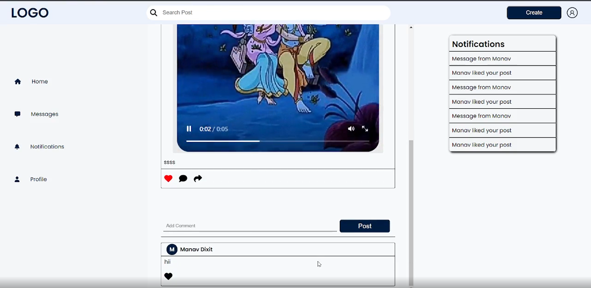

# 🌐 MERN Social Media App

A full-featured social media platform built using the MERN stack (MongoDB, Express, React, Node.js). This app supports user authentication, Google OAuth, email verification, post creation with media (image/video), likes, comments, sharing, and a full follow system.

---

## 🚀 Features

### 🔐 Authentication
- Signup/Login with email & password
- Email verification via tokenized link
- Google OAuth integration

### 📝 Posts
- Create posts with text, images, or videos
- Efficient video uploading with streaming support (chunked upload & playback)
- Like / Comment / Share functionality
- View full post with all interactions

### 👤 User & Social
- User profile page with bio and posts
- Follow/Unfollow users
- Public post exploration

---

## 🛠️ Tech Stack

| Frontend | Backend | Database | Others |
|----------|---------|----------|--------|
| React    | Node.js (Express) | MongoDB (Mongoose) | media stored locally on server |
| Redux | JWT for auth | | Multer + Streams for video |
| CSS  | Nodemailer for email | |  |

---

## 📸 Screenshots

>   
>   
> 

---
## 🎬 Video Demo
1)Dekstop Version
https://youtu.be/RAh3QioGje4
2)Phone Version
https://youtube.com/shorts/_UyYLJPpfQo
## ⚙️ Installation & Setup

# 1. Clone the repo
git clone https://github.com/ManacDixit/Socialmedia.git
cd Socialmedia

# 2. Install backend dependencies
cd backend
npm install

# 3. Install frontend dependencies
cd ../frontend
npm install

# 4. Create .env files for backend and frontend

# 5. Run backend
cd backend
npm run dev  # or npm start

# 6. Run frontend
cd ../frontend
npm start

# Set hostname and port from env
